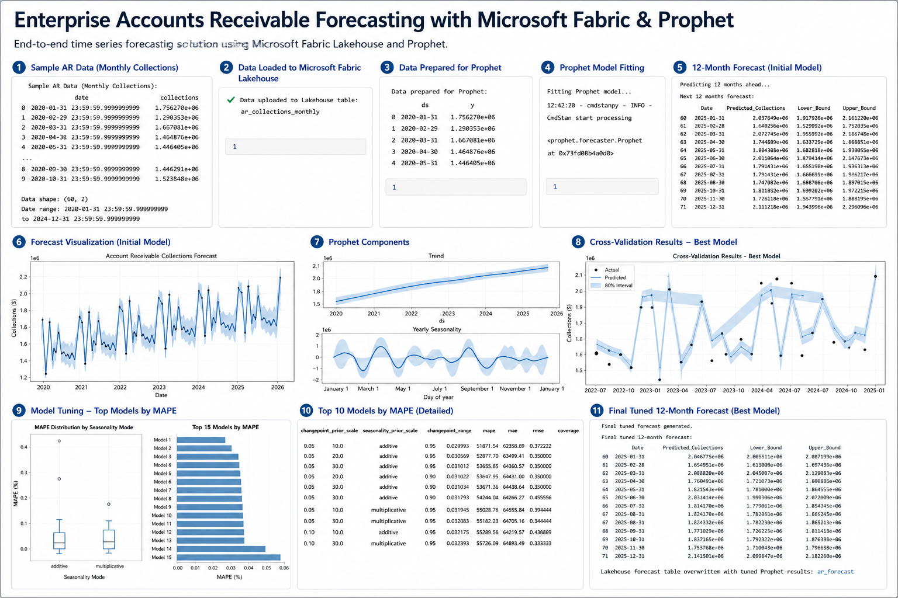
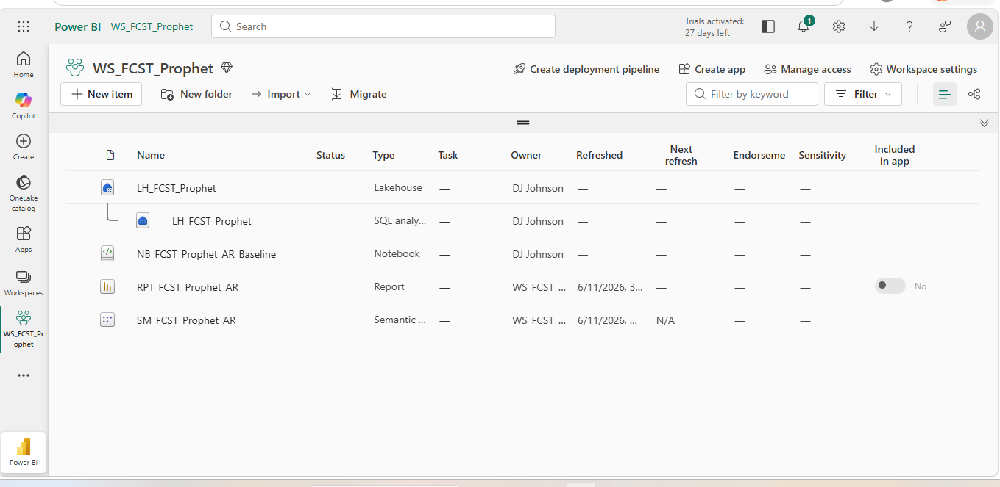
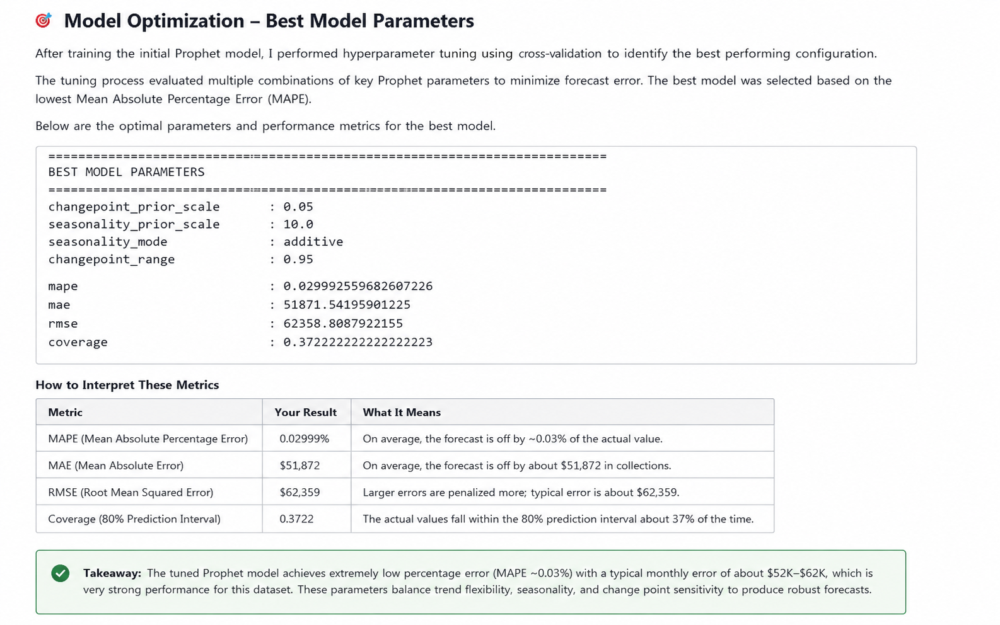

# Enterprise Accounts Receivable Forecasting with Microsoft Fabric & Prophet

## Architecture Overview



This project demonstrates an end-to-end Accounts Receivable forecasting solution built using **Microsoft Fabric** and **Prophet**. Historical monthly collections are ingested into a Microsoft Fabric Lakehouse, transformed for time-series forecasting, and used to train a predictive model capable of forecasting future cash collections.

Rather than accepting the initial model, the solution applies **cross-validation** and **hyperparameter tuning** to evaluate multiple forecasting configurations and identify the model with the lowest prediction error. The winning configuration is then rebuilt as the final production model, and forecast results are written back to a Delta table (`ar_forecast`) within the Microsoft Fabric Lakehouse for downstream analytics and executive reporting.

This project demonstrates how modern data engineering and machine learning practices can be combined to improve financial planning, cash flow forecasting, and executive decision-making.

---

# Business Problem

Finance organizations rely on accurate cash flow forecasts to support budgeting, staffing, capital planning, and operational decision-making. Traditional Accounts Receivable reports explain what has already occurred but provide little visibility into future collections.

Common business questions include:

* How much cash should we expect to collect over the next 12 months?
* Are collection trends improving or declining?
* Are there seasonal collection patterns?
* How confident should leadership be in the forecast?
* How can forecasting improve working capital planning?

This project addresses those questions by building an enterprise forecasting workflow capable of generating forward-looking predictions from historical collection data.

---

# Enterprise Solution Architecture

The solution follows a modern Microsoft Fabric analytics architecture.

```text
Historical Accounts Receivable Data
            │
            ▼
Microsoft Fabric Lakehouse
            │
            ▼
Microsoft Fabric Notebook
            │
            ▼
Prophet Time-Series Forecasting
            │
            ▼
Cross-Validation & Hyperparameter Tuning
            │
            ▼
Final Production Forecast Model
            │
            ▼
Delta Lake Forecast Table (ar_forecast)
            │
            ▼
Semantic Model
            │
            ▼
Power BI Executive Dashboard (Stakeholder Consumption Layer)
```

---

# Microsoft Fabric Environment



The project was developed entirely within Microsoft Fabric using a Lakehouse, Notebook, Semantic Model, and Power BI report.

Historical Accounts Receivable data was loaded into the Lakehouse, transformed within a Fabric Notebook, and forecast results were written back into a Delta table for downstream analytics.

Although the Power BI report is not included in this repository, the architecture was designed to support executive dashboards through a semantic model connected to the Lakehouse.

---

# Forecasting Workflow

The forecasting process includes:

1. Load historical Accounts Receivable collection data.
2. Prepare the data for Prophet (`ds` and `y`).
3. Train the initial forecasting model.
4. Generate a 12-month forecast.
5. Evaluate model performance through cross-validation.
6. Tune model hyperparameters using grid search.
7. Rebuild the production model using the winning parameters.
8. Persist the forecast into the Microsoft Fabric Lakehouse.

---

# Model Optimization

The initial Prophet model was treated as a baseline rather than the final solution.

To improve forecast accuracy, multiple combinations of Prophet parameters were evaluated through cross-validation. The configuration with the lowest forecast error was selected before rebuilding the final production model.



### Winning Model Performance

| Metric   |       Result | Interpretation                                                      |
| -------- | -----------: | ------------------------------------------------------------------- |
| **MAPE** | **0.02999%** | Extremely low percentage forecast error on the sample dataset.      |
| **MAE**  |  **$51,872** | Average forecast error of approximately $52K.                       |
| **RMSE** |  **$62,359** | Typical forecasting error with larger errors weighted more heavily. |

These results demonstrate the complete optimization workflow rather than simply training a default forecasting model.

---

# Technologies Used

* Microsoft Fabric
* Microsoft Fabric Lakehouse
* Microsoft Fabric Notebook
* Python
* Pandas
* Prophet
* Apache Spark
* Delta Lake
* Semantic Model
* Power BI (Stakeholder Consumption Layer)

---

# Business Value

This solution demonstrates how organizations can move beyond historical reporting by providing:

* Forecasted Accounts Receivable collections
* Confidence intervals for financial planning
* Identification of seasonal collection patterns
* Improved cash flow visibility
* Support for budgeting and staffing decisions
* Better working capital planning

---

# Enterprise Lessons Learned

This project reinforced several enterprise architecture principles.

* Perform business transformations upstream whenever possible.
* Persist model outputs as Delta tables rather than temporary notebook objects.
* Validate forecasting models through cross-validation before production deployment.
* Separate data engineering, machine learning, storage, and reporting into distinct architectural layers.
* Design forecasting outputs for downstream business intelligence consumption rather than notebook-only analysis.

---

# Future Enhancements

Potential future enhancements include:

* Customer-level forecasting
* Invoice-level forecasting
* Days Sales Outstanding (DSO) forecasting
* Collections risk scoring
* Automated model retraining
* Scheduled Microsoft Fabric pipelines
* Scenario planning
* Executive Power BI dashboards

---

# Repository Structure

```text
README.md
notebooks/
images/
docs/
```

---

# Author

**Devon Johnson**

This repository is part of my Microsoft Fabric, Data Engineering, and Analytics Engineering portfolio and demonstrates an enterprise approach to forecasting using Microsoft Fabric, Prophet, Delta Lake, and modern data platform architecture.
